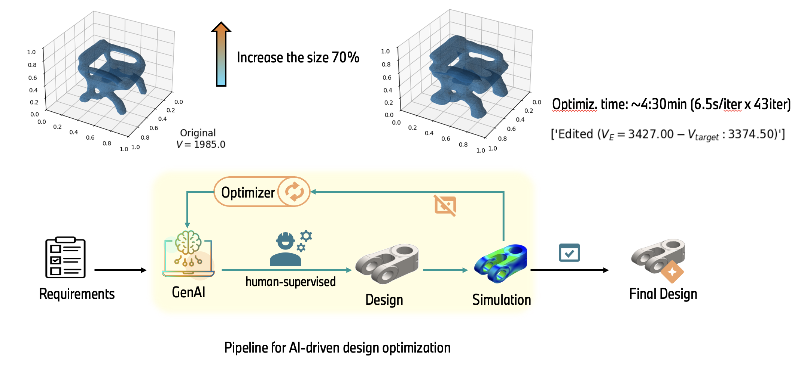

## Physic-informed SDF editing using SDF-Diffusion
Details see scripts.



**Simulation-oriented editing with sdf:**
1. DDim inversion + latent optimization
Similar latent optimization method
Different model: SDF-Diffusion, which outputs Signed Distance Fields (SDFs) --> easier to compute property estimates (e.g., volume) in a differentiable manner


2. DDim inversion + noise guidance:
Same model (SDF-Diffusion), same objective function (using the best version of volume_estimates). However, the gradient is applied at each denoising step to guide the generation

Noise guidance: \
(+) Faster (single gradient update per denoising step)\
(-) Less accurate in achieving the target value \
(-) Lower quality due to potential latent perturbation in final steps, resulting in a noisy shape\
Instead, latent optimization is more controllable (loss threshold, num. iterations, …), but it comes at the cost of more iterations\

Future works: 
Mix the two methods, i.e., perform some optimization steps in a subset of denoising steps 
Debug why optimization on the denoised shape (𝑥_0^𝐸 ) ̂ (i.e., backpropagating the gradients over all the denoising steps -- tgt_noise_level="zero”) is not feasible (out of memory) with the new DDIM functions1 whereas it was possible previously.


## Environment installation 
Install the `pytorch3d` environment as explained [here](https://github.com/facebookresearch/pytorch3d/blob/main/INSTALL.md). For linux: 
```
conda create -n pytorch3d python=3.9
conda activate pytorch3d
conda install pytorch=1.13.0 torchvision pytorch-cuda=11.6 -c pytorch -c nvidia
conda install -c iopath iopath
conda install -c bottler nvidiacub
conda install pytorch3d -c pytorch3d
```

Then, install the required packages with
```
pip install -r requirements.txt
```


## Dataset

The preprocessed dataset can be downloaded in [Huggingface](https://huggingface.co/datasets/kitsunetic/SDF-Diffusion-Dataset)

The dataset (~13GB for resolution 32, ~50GB for 64) should be unzipped and located like this:

```
SDF-Diffusion
├── config
    ├── gen32
        ├── airplane.yaml
        ├── ...
        ├── shapenet.yaml
    ├── sr32_64
        ├── airplane.yaml
        ├── ...
        ├── shapenet.yaml
├── src
    ├── datasets  # dataset-related codes
    ├── models  # network architectures
    ├── utils
    ├── ...
    ├── trainer.py  # custom trainer
├── results  # pretrained checkpoints
    ├── gen32
        ├── airplane.pth
        ├── ...
        ├── shapenet.pth
    ├── sr32_64
        ├── airplane.pth
        ├── ...
        ├── shapenet.pth        
├── main.py

data
├── sdf.res32.level0.0500.PC15000.pad0.20.hdf5
├── sdf.res64.level0.0313.PC15000.pad0.20.hdf5
```

SDF-Diffsuion see paper:

Diffusion-Based Signed Distance Fields for 3D Shape Generation (CVPR 2023)

[**Paper**](https://openaccess.thecvf.com/content/CVPR2023/html/Shim_Diffusion-Based_Signed_Distance_Fields_for_3D_Shape_Generation_CVPR_2023_paper.html) | [**Project Page**](https://kitsunetic.github.io/sdf-diffusion/)

Before downloading the dataset, please create [ShapeNet webpage](https://shapenet.org) and consider citing ShapeNet:
```bib
@article{chang2015shapenet,
  title={Shapenet: An information-rich 3d model repository},
  author={Chang, Angel X and Funkhouser, Thomas and Guibas, Leonidas and Hanrahan, Pat and Huang, Qixing and Li, Zimo and Savarese, Silvio and Savva, Manolis and Song, Shuran and Su, Hao and others},
  journal={arXiv preprint arXiv:1512.03012},
  year={2015}
}
```
The dataset can be used only for non-commercial research and educational purpose.


## Checkpoints

You can download pretrained checkpoints for [unconditional](https://github.com/Kitsunetic/SDF-Diffusion/releases/download/checkpoint/gen32.zip) and [category-conditional](https://github.com/Kitsunetic/SDF-Diffusion/releases/download/checkpoint/sr32_64.zip).
Please unzip the `.zip` files in `./results` folder.

You can find demo scripts in [unconditional](./scripts/demo-single_category.ipynb) and [category-conditional](./scripts/demo-multi-category.ipynb).

